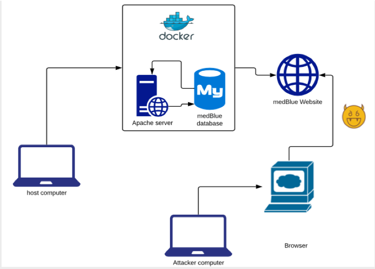
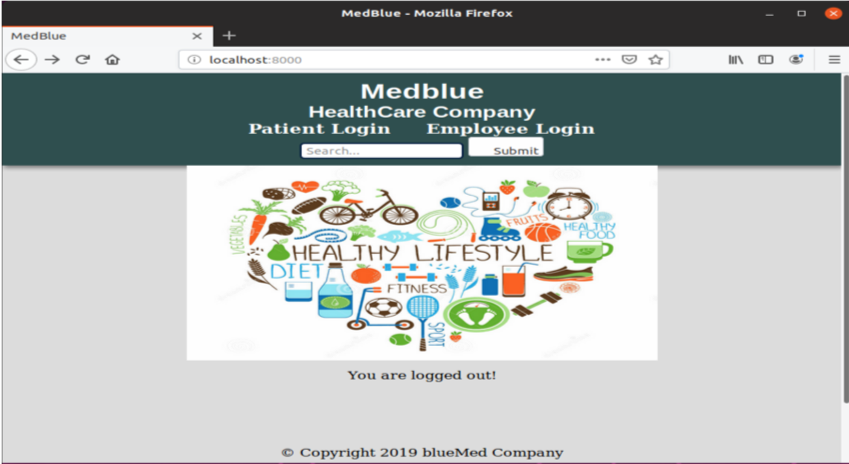

# Intro to Web Application Security Workshop

## Background

* The Health Insurance Portability and Accountability Act’s (HIPPA) Security Rule was designed to protect a person’s electronic health records and preserve its confidentiality, integrity and availability.
Currently, Healthcare databases are responsible for the storing, integrity maintenance and rapid accessibility of sensitive data.
Along with the implementation of databases in the healthcare industry, comes a web security concern.

* Currently, Healthcare databases are responsible for the storing, integrity maintenance and rapid accessibility of sensitive data.

* Along with the implementation of databases in the healthcare industry, comes a web security concern.

## Scenario

* medBlue is a healthcare provider which provides access to Patient Information and an Employee Service Center online.

* medBlue is a new healthcare record storage company that has not completely abided to HIPAA’s Security Rule.

* Participants will act as the developer and tester of their own medBlue’s website.

* Participants will learn to identify, and exploit vulnerabilities found in medBlue’s website. 

## Tasks

* Visit medBlue’s website and through the Patient Login page gain unauthorized access to a patient account using a brute force attack.

* Test for XSS attack vulnerabilities.

* Use SQLmap to identify other vulnerabilities in the website and database.

* Conduct a successful SQL Injection in the Employee Login page to steal sensible information.

## Outcomes

* Participants will learn the importance of properly securing websites to avoid their exploit and the stealing of sensitive information.

* Participants will learn about the tools available to secure database access through the web, techniques used by attackers to perform an SQL Injection in vulnerable code and how to conduct a simple XSS attack. 

* Participants will learn basic SQL commands and PHP syntax.

